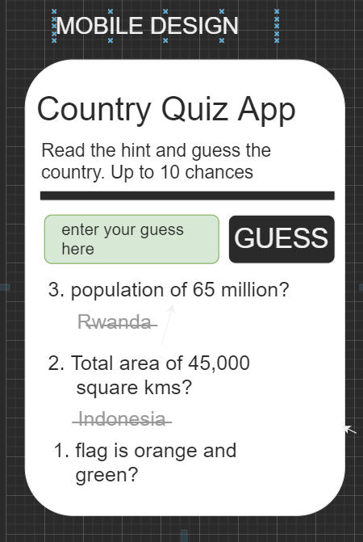
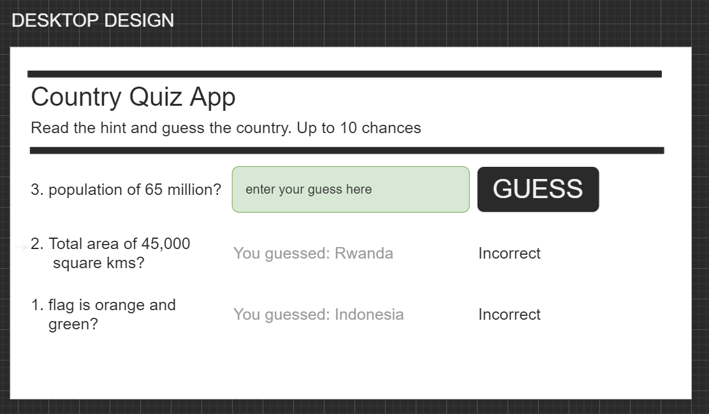
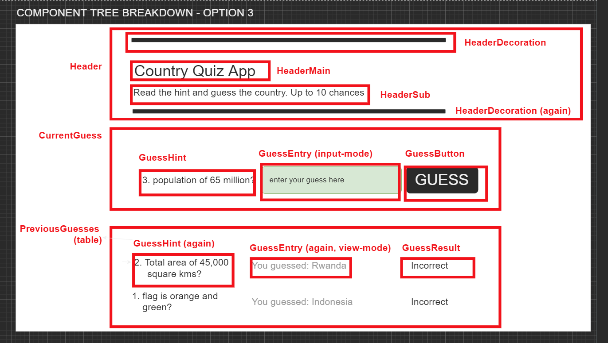

# "Guess the Country" Quiz App

Guess a randomly-selected country, based on a series of hints. Front end React app, retrieving data from RESTful API.

_with thanks to the API creators of https://restcountries.com/v3.1, which i'm using for this demo_

## Aim

Given a series of facts about a country chosen at random, the aim is for the player to guess the country using as few facts as possible. Each time the player makes an incorrect guess, an additional country-related fact displays, whilst the previous facts, and guesses, are also displated below.

## How to play

### Process

-   when the page loads,
    -   In the background, a random country is retrieved from the API and
    -   A single fact about that country is displayed
-   the player enters a guess and presses 'Guess' when happy
-   The application checks - if they are correct - they win (that round?)
-   if they are not correct, a new fact is displayed and the player can guesss again
-   the previous facts and guesses are displayed in a groing list inderneath the current hint and guess entry field
-   there is an 'i give up' button/link - if this is pressed, the games ends and the answer is displayed.

### Scoring

-   player starts with 10 points. Loses a point for each fact displayed before they guess the right answer.

### Ending the Game

-   When the player guesses the country correctly,
-   or when the 10 facts/hints have been used up without guessing correctly,
-   or when the player short-circuits the game by pressing the 'i give up' button,
    then the games ends and the correct answer is shown.

## Design

### Wireframes

 

### Component Breakdown

## Documentation:

Wireframe design and Component breakdown are here:

[quiz-design.drawio](./quiz-design.drawio)

Plan for how to break down the problem is here:

[quiz-plan.md](./quiz-plan.md)
